# Steam Game Recommendation System


A personalized game recommendation system for Steam users. This project leverages user data to suggest new games that a user might enjoy. This is an ongoing personal project.

## Table of Contents

- [About The Project](#about-the-project)
  - [Built With](#built-with)
- [Architecture](#architecture)
- [Getting Started](#getting-started)
  - [Prerequisites](#prerequisites)
  - [Installation](#installation)
- [Usage](#usage)
- [Database](#database)
- [Future Work](#future-work)
- [Contributing](#contributing)
- [License](#license)
- [Contact](#contact)

## About The Project

This project aims to provide Steam users with personalized game recommendations based on their gaming history and preferences. With thousands of games available on Steam

### Built With

This project is built with the following technologies:

* [Python](https://www.python.org/) (Polars, Streamlit, beautifulsoup4)
* [Flask](https://flask.palletsprojects.com/en/2.0.x/)
* [AWS RDS](https://aws.amazon.com/rds/) (for the database)
* [AWS EC2](https://aws.amazon.com/ec2/) (for hosting the server)

## Architecture

The system follows a simple architecture:

1.  **Data Collection & Preprocessing (Python Script):** A Python script is responsible for fetching, cleaning, and preprocessing the Steam user data.
2.  **Database (AWS RDS):** The processed data is stored in a relational database hosted on AWS RDS. This allows for efficient querying and management of the data.
3.  **Recommendation Engine (Python on EC2):** The core recommendation logic is implemented in Python and runs on an AWS EC2 instance. This engine can use various recommendation algorithms (e.g., collaborative filtering, content-based filtering) to generate recommendations.
4.  **API Server (Python on EC2):** A web server (e.g., built with Flask) exposes API endpoints that allow users or a front-end application to request recommendations.

## Getting Started

To get a local copy up and running, follow these simple steps.

### Prerequisites

Make sure you have the following installed:

* Python 3.8+
* pip

### Installation

1.  **Clone the repo**
    ```sh
    git clone "https://github.com/vaishnn/steam-game-recommendations.git"
    ```
2.  **Install Python packages**
    ```sh
    pip install -r requirements.txt
    ```
3.  **Set up environment variables**

    Create a `.env` file in the root directory and add your AWS and database credentials:
    ```
    AWS_ACCESS_KEY_ID='YOUR_AWS_ACCESS_KEY'
    AWS_SECRET_ACCESS_KEY='YOUR_AWS_SECRET_KEY'
    DB_HOST='YOUR_RDS_ENDPOINT'
    DB_USER='YOUR_DB_USER'
    DB_PASSWORD='YOUR_DB_PASSWORD'
    DB_NAME='YOUR_DB_NAME'
    ```

## Usage

1.  **Run the data processing script:**
    ```sh
    python CreatingTables.py
    # python DataInsertion.py (Currently Developing)
    # Developing Further Steps
    ```
2.  **Start the server:**
    ```sh
    Streamlit run app.py
    # Server integration with backend is still in process
    ```
The server will start on 'http://localhost:8501/`.
**Example API Endpoint:**

* `GET /recommendations?user_id=<steam_user_id>`

    Returns a JSON list of recommended game IDs for the given user.

## Database

The database is hosted on AWS RDS and uses a PostgreSQL (or your chosen) engine. The schema is designed to store user and game information efficiently.

**Key Tables:**

```mermaid
erDiagram
    users {
        int user_id PK
        varchar username
        varchar email
        bigint steam_id
        datetime registration_date
        datetime last_login
        json user_preferences
    }
    games {
        int id PK
        varchar name
        date release_date
        decimal price
        int positive_reviews
        int negative_reviews
        text short_description
    }
    developers {
        int id PK
        varchar name
    }
    publishers {
        int id PK
        varchar name
    }
    categories {
        int id PK
        varchar name
    }
    genres {
        int id PK
        varchar name
    }
    languages {
        int id PK
        varchar name
    }
    audio_languages {
        int id PK
        varchar name
    }
    tags {
        int id PK
        varchar name
    }
    achievements {
        int id PK
        int game_id FK
        varchar external_id
        varchar name
        text description
    }
    game_reviews {
        int id PK
        int game_id FK
        int user_id FK
        text review_text
        boolean is_recommended
    }
    game_rankings {
        int id PK
        int game_id FK
        varchar ranking_type
        decimal ranking_value
    }
    user_game_interactions {
        int id PK
        int user_id FK
        int game_id FK
        varchar interaction_type
        decimal interaction_value
    }
    user_achievements {
        int id PK
        int user_id FK
        int achievement_id FK
        datetime unlocked_date
    }
    game_developers {
        int game_id PK, FK
        int developer_id PK, FK
    }
    game_publishers {
        int game_id PK, FK
        int publisher_id PK, FK
    }
    game_categories {
        int game_id PK, FK
        int category_id PK, FK
    }
    game_genres {
        int game_id PK, FK
        int genre_id PK, FK
    }
    game_audio_languages {
        int game_id PK, FK
        int language_id PK, FK
    }
    game_supported_languages {
        int game_id PK, FK
        int language_id PK, FK
    }
    game_tags {
        int game_id PK, FK
        int tag_id PK, FK
    }

    users ||--o{ user_game_interactions : "has"
    games ||--o{ user_game_interactions : "has"
    users ||--o{ game_reviews : "writes"
    games ||--o{ game_reviews : "has"
    users ||--o{ user_achievements : "unlocks"
    achievements ||--o{ user_achievements : "is unlocked by"
    games ||--o{ achievements : "has"
    games ||--o{ game_rankings : "has"

    games }o--|| game_developers : "developed by"
    developers ||--o{ game_developers : "develops"

    games }o--|| game_publishers : "published by"
    publishers ||--o{ game_publishers : "publishes"

    games }o--|| game_categories : "has"
    categories ||--o{ game_categories : "belongs to"

    games }o--|| game_genres : "has"
    genres ||--o{ game_genres : "belongs to"

    games }o--|| game_audio_languages : "supports"
    audio_languages ||--o{ game_audio_languages : "is supported in"

    games }o--|| game_supported_languages : "supports"
    languages ||--o{ game_supported_languages : "is supported in"

    games }o--|| game_tags : "has"
    tags ||--o{ game_tags : "is applied to"

```



## Future Work

This is an ongoing project, and here are some of the planned features and improvements:

* [ ] Implement and compare different recommendation algorithms (e.g., matrix factorization, deep learning models).
* [ ] Develop a simple web interface to display recommendations.
* [ ] Improve the data pipeline to handle larger datasets more efficiently.
* [ ] Add more features to the recommendation model (e.g., game tags, user reviews).
* [ ] Scale the system to handle more users and requests.

## Contributing

Contributions are what make the open-source community such an amazing place to learn, inspire, and create. Any contributions you make are **greatly appreciated**.

If you have a suggestion that would make this better, please fork the repo and create a pull request. You can also simply open an issue with the tag "enhancement".

1.  Fork the Project
2.  Create your Feature Branch (`git checkout -b feature/AmazingFeature`)
3.  Commit your Changes (`git commit -m 'Add some AmazingFeature'`)
4.  Push to the Branch (`git push origin feature/AmazingFeature`)
5.  Open a Pull Request

## License

Distributed under the MIT License. See `LICENSE` for more information.

## Contact

Your Name - [@your_twitter](https://twitter.com/your_twitter) - your.email@example.com

Project Link: [https://github.com/your_username/your_project_name](https://github.com/your_username/your_project_name)
